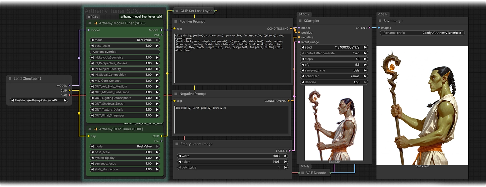
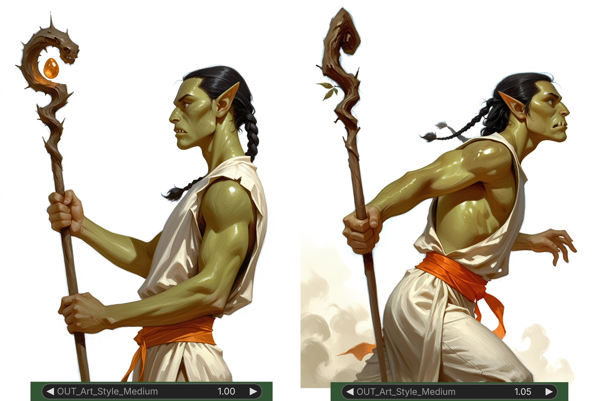

# Arthemy Live Tuner SDXL ComfyUI
ComfyUI nodes useful to Tweak SDXL, Illustrious, and NAI models by adjusting specific 'slices'. These nodes break the U-Net and CLIP into areas of application (like Style, Lighting, Word Logic...) and use individual weights to boost or lower the intensity of any of those sections without training.


---

# ✨ Arthemy Live Tuner - SDXL

Hi everyone!

After years experimenting with SDXL (including variants like Illustrious and NAI) and deep diving into model merging, I developed these nodes for ComfyUI to offer granular control over a single model.

I utilized the block-splitting logic found in tools like "SDXL Block Merge" and reorganized those technical segments into functional groups based on their visible impact on generation. Instead of merging two models, these nodes act on a single model, allowing you to amplify or reduce the intensity of those areas.

This process is fast and can be seamlessly integrated into any workflow, effectively transforming static checkpoints into a set of "Sliders" for precise control over the output.



---

## Model Tuner: Application Areas

Use these sliders to fine-tune specific blocks within the SDXL U-Net.
Keep in mind that, while each area targets a specific visual aspect, these blocks do not operate in isolation. Because of the interdependent nature of the model, changing one weight will have a dominant effect on its primary area, but it also affects the others.
These areas are still experimental guidelines that will be refined with time.

### Input Blocks (Structure and Composition)

* **IN_Layout_Geometry**: Affects high-resolution spatial features and the basic structural "bones" of the image.
* **IN_Perspective_Masses**: Influences global shapes and the overall perspective of the scene.
* **IN_Subject_Identity**: Controls object semantics and the primary structure of the subject.
* **IN_Global_Composition**: Manages deep semantics and the abstract arrangement of elements.

### Middle Block (The Core)

* **MID_Core_Concept**: Acts on the semantic heart of the image, where the core concept is processed.

### Output Blocks (Style and Rendering)

* **OUT_Art_Style_Medium**: The primary driver for the artistic style and chosen medium.
* **OUT_Material_Substance**: Controls the physical quality and substance of materials.
* **OUT_Lighting_Atmosphere**: Manages volumetrics, lighting, and general environmental mood.
* **OUT_Shadows_Depth**: Influences shadow placement, depth, and overall contrast.
* **OUT_Texture_Details**: Targets high-frequency details such as skin pores, fabric weave, and fine textures.
* **OUT_Final_Sharpness**: Handles final pixel refinement and sharpness.

### Examples

For this example, I've used my model [Arthemy Painter Illustrious v4.0](https://civitai.com/models/1598875?modelVersionId=2598065) and I've written this prompt:

```
oil painting (medium), (chiaroscuro), perspective, fantasy, solo, ((sketch)), fog, dynamic pose.
((white background, simple background)), ((upper body, side view)), calm, serene, silver eyes, running, braided hair, black hair, half-elf, olive skin, sharp jaw, athletic, 1boy, cloth, simple tunic, monk, orange belt, tan pants, holding staff, white theme.
```


Here, by increasing the "OUT_Shadows-Depth" to "1.20" (which is a crazy amount), the output looks deeper and darker without affecting the composition very much (Of course, by lowering this value the result would end up lighter and less defined)



On the other hand, by increasing the value of "OUT_Art_Style_Medium" to "1.05" (this is a very sensitive part of the model) the output has a more powerful art style, which also granted a closer representation of what I wrote in the prompt (Here "Fog" and "Running" seems to have emerged too).

---

## CLIP Tuner: Semantic Areas

This node divides the 32 layers of the SDXL CLIP model (ViT-bigG) into three logical blocks to control how the AI interprets your prompt:

* **Syntax Rigidity**: Controls grammar, word order, and how strictly the AI parses the sentence structure.
* **Semantic Focus**: Targets subject recognition, actions, and specific object attributes.
* **Style Abstraction**: Influences global composition and artistic abstraction, prioritizing vibe over literal words.

### Examples


Here, I've solved the issue lowering the value of the "Semantic Focus" which was too "Stiff" in my model, granting it the ability to be more flexible with the poses - with the downside that I've lose a little bit of its style.


In this alternative solution, I've solved the issue increasing the value of "Style Abstraction" to make the model "work harder" in the composition - with the downside that I don't really like his new face and I'll have to fix.

---

## Tuning Modes: Soft vs. Real Value

The node offers two mathematical approaches to weighting:

1. **Soft Value**: The values added here are converted in a much lighter change in the model / CLIP so you can play with any value from "0.0" to "2.0" without much trouble, ideal for chirurgical modifications.
2. **Real Value**: A direct linear multiplier (the one I've used in the previous examples, I do not suggest to move outside the "0.8" to "1.2" range)

**Important Note on Real Value Mode**: This mode is extremely sensitive. Small increments (e.g., 0.01 or 0.02) are recommended for precise tuning.

---

## Installation

1. Navigate to your `ComfyUI/custom_nodes/` folder.
2. Run: `git clone https://github.com/aledelpho/Arthemy_Live-Tuner-SDXL-ComfyUI.git`
3. Restart ComfyUI.

---
